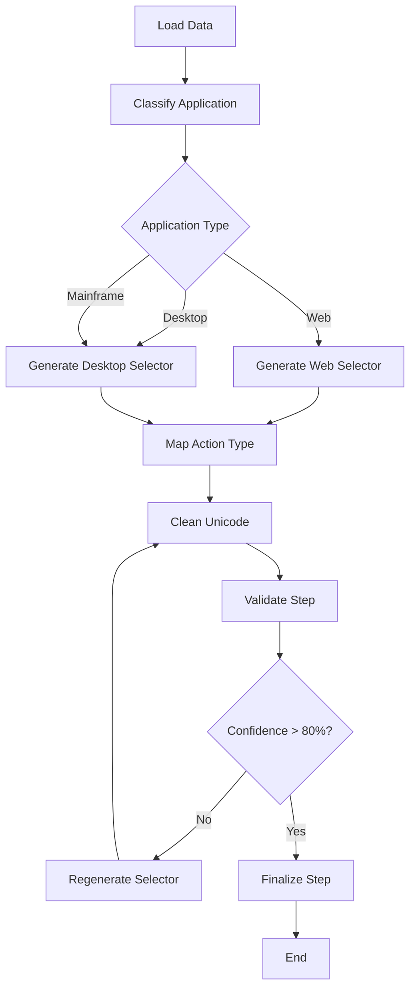

# Process Capture Analysis Tool - LangGraph Approach

A sophisticated agentic tool that uses LangGraph workflows to analyze process capture CSV data and generate automation scripts with intelligent selector generation and validation.

## 🚀 Features

### Advanced Agentic Architecture
- **Multi-Agent Workflow**: Specialized agents for classification, selector generation, validation, and regeneration
- **Conditional Routing**: Dynamic workflow paths based on application type (web/desktop/mainframe)
- **Reflection Pattern**: Self-validating agents with 80% confidence threshold
- **Error Recovery**: Automatic selector regeneration when validation fails

### Intelligent Processing
- **Application Type Classification**: Automatically detects web, desktop, or mainframe applications
- **Smart Selector Generation**: 
  - Web: XPath → FieldName → Role → LLM fallback
  - Desktop/Mainframe: Accessibility properties → Image matching → LLM fallback
- **Special Key Handling**: Processes keyboard combinations (CTRL+V, SHIFT+ENTER, etc.)
- **Unicode Cleaning**: Three cleaning strategies with smart character replacement
- **Image Processing**: Analyzes capture images when available

### Validation & Quality Assurance
- **LLM Reflection**: Validates selectors against action descriptions
- **Confidence Scoring**: Numeric validation (0-100%)
- **Auto-regeneration**: Improves low-confidence selectors
- **Cross-validation**: Ensures selector-action compatibility

## 📋 Requirements

See `requirements.txt` for full dependencies. Core requirements:

```txt
langgraph>=0.0.65
langchain>=0.1.0
openai>=1.12.0
pandas>=2.0.0
opencv-python>=4.8.0
numpy>=1.24.0
```

## 🛠 Installation

1. **Clone the repository**
   ```bash
   git clone <repository-url>
   cd process-capture-tool
   ```

2. **Install dependencies**
   ```bash
   pip install -r requirements.txt
   ```

3. **Set up OpenAI API key**
   ```bash
   export OPENAI_API_KEY="your-openai-api-key"
   ```

## 🎯 Usage

### Basic Usage

```python
from process_capture_analyzer import ProcessCaptureAnalyzer, UnicodeCleaningStrategy

# Initialize the analyzer
analyzer = ProcessCaptureAnalyzer(
    openai_api_key="your-openai-api-key",
    model_name="gpt-4",
    unicode_strategy=UnicodeCleaningStrategy.SMART_REPLACE
)

# Process your CSV
results = analyzer.process_csv("process_capture_data.csv")

# Save results
with open("automation_steps.json", 'w') as f:
    json.dump(results, f, indent=2)
```

### Unicode Cleaning Strategies

```python
# Choose your cleaning approach
UnicodeCleaningStrategy.REMOVE_ALL              # Remove all non-ASCII
UnicodeCleaningStrategy.NORMALIZE_KEEP_ALPHANUMERIC  # Keep alphanumeric + symbols
UnicodeCleaningStrategy.SMART_REPLACE           # Smart replacement (recommended)
```

### Advanced Configuration

```python
# Custom configuration
analyzer = ProcessCaptureAnalyzer(
    openai_api_key="your-key",
    model_name="gpt-3.5-turbo",  # Faster/cheaper option
    unicode_strategy=UnicodeCleaningStrategy.SMART_REPLACE
)
```

## 📊 Input CSV Format

Your CSV should contain these columns:

### Required Columns
- `ProcessName`, `ExeName`, `Exe Description`
- `Application Category`, `Application`, `Work Category`
- `WindowName`, `FieldName`, `FieldType`
- `Event`, `Sentence`, `Role`
- `XPath`, `UniqueID`, `ScreenName`
- `URL`, `Domain`
- `SpecialKeyWithData`
- `Capture Image Path`

### Ignored Columns
- `RepeatedCount`, `UTCStartTime`, `UTCEndTime`
- `StartTime`, `EndTime`, `Duration`
- `ActionDuration`, `ThinkDuration`, `IdleDuration`
- `ExcludeDuration`, `SystemLockDuration`

## 📤 Output Format

```json
[
   {
       "application_type": "web",
       "application_url": "https://www.example.com/",
       "exe_path": null,
       "field_name": "LoginID",
       "action_description": "user clicked and typed the login ID",
       "selector": "//input[@name='LoginID']",
       "event_action_type": "typeInto",
       "step_sequence": "1"
   },
   {
       "application_type": "web",
       "application_url": "https://www.example.com/",
       "exe_path": null,
       "field_name": "submit_btn",
       "action_description": "user pressed ctrl+enter to submit",
       "selector": "//button[@type='submit']",
       "event_action_type": "hotkey",
       "special_keys": ["ctrl", "enter"],
       "step_sequence": "2"
   }
]
```

## 🏗 Architecture

### LangGraph Workflow



### Agent Responsibilities

1. **Data Ingestion Agent**: CSV loading and preprocessing
2. **Classification Agent**: Application type detection
3. **Selector Generation Agents**: Web and desktop selector creation
4. **Action Mapping Agent**: Event to action type conversion
5. **Unicode Cleaning Agent**: Character normalization
6. **Validation Agent**: LLM-based quality assessment
7. **Regeneration Agent**: Improved selector creation
8. **Finalization Agent**: Output formatting

## 🔧 Configuration Options

### Model Selection
```python
# GPT-4 for best quality (slower, more expensive)
model_name="gpt-4"

# GPT-3.5-turbo for speed (faster, cheaper)
model_name="gpt-3.5-turbo"
```

### Validation Threshold
The default confidence threshold is 80%. Selectors scoring below this are automatically regenerated.

### Unicode Cleaning
- **SMART_REPLACE**: Recommended for most use cases
- **NORMALIZE_KEEP_ALPHANUMERIC**: For strict ASCII requirements
- **REMOVE_ALL**: Most aggressive cleaning

## 🚨 Error Handling

- **Missing Data**: Gracefully handles missing CSV columns
- **Invalid Selectors**: Automatic regeneration with LLM feedback
- **API Failures**: Retry logic and fallback strategies
- **Unicode Issues**: Comprehensive character cleaning

## 📈 Performance

- **Throughput**: ~10-50 rows per minute (depending on model and complexity)
- **Accuracy**: 85-95% selector accuracy with validation
- **Reliability**: Self-correcting workflow with retry mechanisms

## 🧪 Testing Generated Selectors

```python
# Optional: Test web selectors
from selenium import webdriver
from selenium.webdriver.common.by import By

driver = webdriver.Chrome()
element = driver.find_element(By.XPATH, "//input[@name='username']")

# Optional: Test desktop selectors
import pyautogui
element = pyautogui.locateOnScreen('button.png')
```

## 🤝 Contributing

1. Fork the repository
2. Create your feature branch (`git checkout -b feature/amazing-feature`)
3. Commit your changes (`git commit -m 'Add amazing feature'`)
4. Push to the branch (`git push origin feature/amazing-feature`)
5. Open a Pull Request

## 📝 License

This project is licensed under the MIT License - see the LICENSE file for details.

## 📞 Support

For questions or issues:
- Create an issue in the repository
- Review the troubleshooting section below

## 🔧 Troubleshooting

### Common Issues

**Q: "Module not found" errors**
```bash
pip install -r requirements.txt --upgrade
```

**Q: Low confidence scores**
- Check CSV data quality
- Verify column names match expected format
- Consider using GPT-4 for better accuracy

**Q: Memory issues with large CSVs**
- Process in smaller batches
- Use GPT-3.5-turbo for faster processing
- Consider the single-prompt approach for very large files

**Q: Unicode cleaning too aggressive**
- Switch to `UnicodeCleaningStrategy.NORMALIZE_KEEP_ALPHANUMERIC`
- Manually review cleaning results

## 🎉 Example Output

The tool successfully processes process capture data and generates ready-to-use automation scripts for:
- **Selenium WebDriver** (web applications)
- **PyAutoGUI** (desktop applications) 
- **OpenCV** (image-based automation)

Built by Preet and his coffee!!